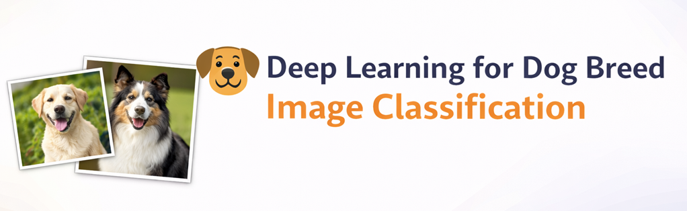
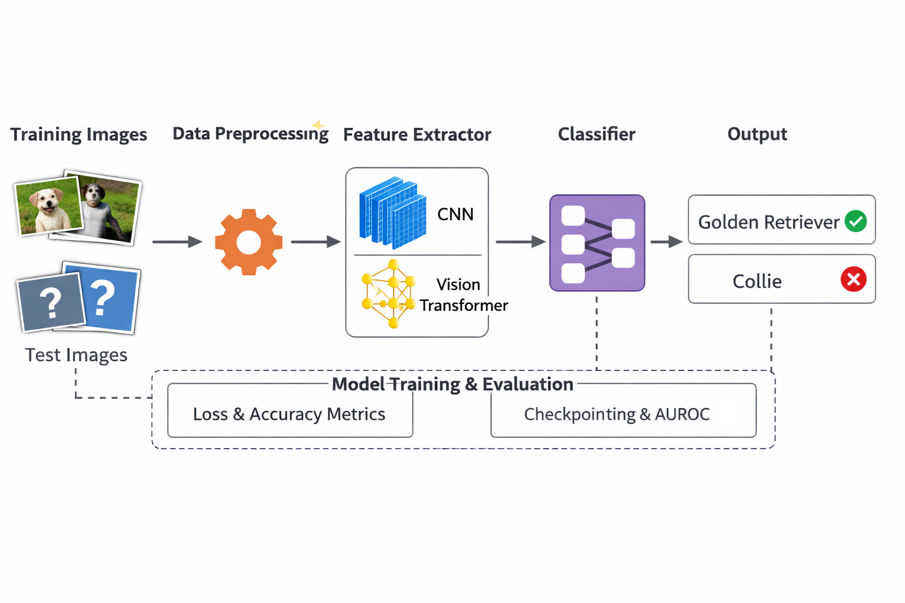
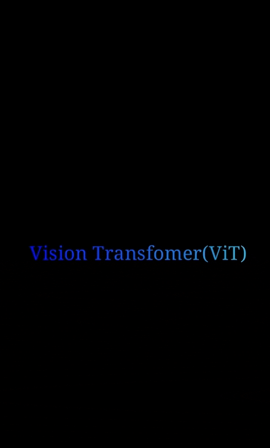
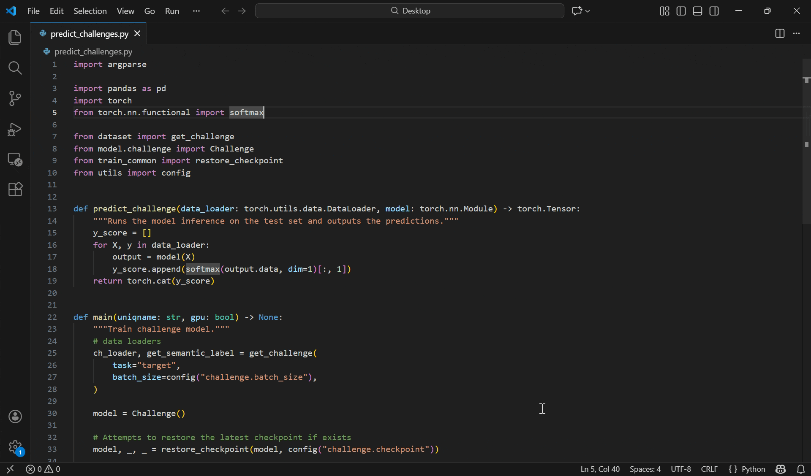

<p align="center">
  
</p>

# Deep Learning for Dog Breed Image Classification

A complete deep learning pipeline for **binary dog breed classification** (Golden Retriever vs Collie) and representation learning, featuring CNNs, transfer learning, and a custom-built Vision Transformer (ViT). Designed for machine learning students, researchers, and engineers interested in end-to-end computer vision systems.

---

## Table of Contents
1. [Project Overview](#project-overview)
2. [Quickstart](#quickstart)
3. [Key Features](#key-features)
4. [Architecture](#architecture)
5. [Usage Examples](#usage-examples)
6. [Vision Transformer Walkthrough](#vision-transformer-walkthrough)
7. [Challenge Model & Prediction Pipeline](#challenge-model--prediction-pipeline)
8. [Installation & Training GIFs](#installation--training-gifs)
9. [FAQ](#faq)
10. [Dependencies](#dependencies)
11. [Contributing](#contributing)
12. [Acknowledgements](#acknowledgements)

---

## Project Overview

This project implements a full deep learning workflow for **image classification of dog breeds**, focusing on:

- Binary classification (Golden Retriever vs Collie)
- Supervised pretraining on additional breeds
- Transfer learning experiments
- A fully custom Vision Transformer (ViT)
- A configurable challenge model for leaderboard-style evaluation

It was developed as part of an advanced machine learning course to explore **representation learning, model generalization, and architectural tradeoffs** between CNNs and Transformers.

---

## Quickstart

### 1. Clone the Repository
```bash
git clone https://github.com/oaydas/dog-breed-classification.git
cd dog-breed-classification
```

### 2. Create Conda Environment
```bash
conda create --name dl-dogs --file requirements.txt
conda activate dl-dogs
```

### 3. Train Baseline CNN
```bash
python train_cnn.py
```

### 4. Evaluate Model
```bash
python test_cnn.py
```

---

## Key Features

| Feature | Description |
|--------|-------------|
| CNN Baseline | Custom convolutional network for binary classification |
| Transfer Learning | Pretrain on 10 breeds, fine-tune on target task |
| Vision Transformer | Full ViT from scratch (attention, patching, encoder blocks) |
| Challenge Model | Modular architecture for hidden test set inference |
| Early Stopping | Automatic checkpointing and validation-based stopping |
| AUROC Tracking | Medical-grade evaluation metric for robustness |

---

## Architecture

<p align="center">
  
</p>

**Pipeline Flow:**
```
Raw Images → Standardization → CNN / ViT Encoder → Classifier Head → Metrics → Checkpointing
```

Components:
- `dataset.py` — normalization & loaders
- `models/` — CNN, ViT, transfer models
- `train_*.py` — training pipelines
- `utils.py` — metrics, early stopping, logging

---

## Usage Examples

### CNN Training
```bash
python train_cnn.py
```

### Transfer Learning
```bash
python train_source.py
python train_target.py
```

### Vision Transformer
```bash
python train_vit.py
```

### Generate Challenge Predictions
```bash
python predict_challenge.py submission
```

Produces:
```
submission.csv
```

---

## Vision Transformer Walkthrough

<p align="center">
  
</p>

The ViT implementation includes:
- Patch embedding (16×16)
- Multi-Head Self Attention
- LayerNorm + MLP blocks
- [CLS] token pooling
- Positional encodings

Implemented manually in `models/vit.py` without relying on PyTorch’s high-level transformer API.

---

## Challenge Model & Prediction Pipeline

<p align="center">
  
</p>

The challenge system supports:
- Hidden test labels
- CSV submission formatting
- Ensemble-ready outputs
- AUROC-based validation selection

---

## FAQ

**Q: Why use ViT for such small images?**  
A: To study attention behavior and compare inductive bias vs CNN locality.

**Q: Is this GPU required?**  
A: No. CPU runs in ~20 minutes per model. GPU optional.

**Q: Can I extend to multi-class?**  
A: Yes — change final layer and loss in `models/target.py`.

**Q: Why AUROC instead of accuracy?**  
A: More robust under class imbalance and probabilistic evaluation.

---

## Dependencies

- Python 3.9+
- PyTorch
- NumPy
- Pandas
- scikit-learn
- matplotlib
- tqdm

Install via:
```bash
pip install -r requirements.txt
```

---

## Contributing

1. Fork the repo  
2. Create a feature branch  
3. Add experiments or visualizations  
4. Submit a pull request  

---

## Acknowledgements

- PyTorch Team  
- Stanford CS231n  
- Dosovitskiy et al., *An Image is Worth 16x16 Words*  
- University of Michigan EECS 445  
